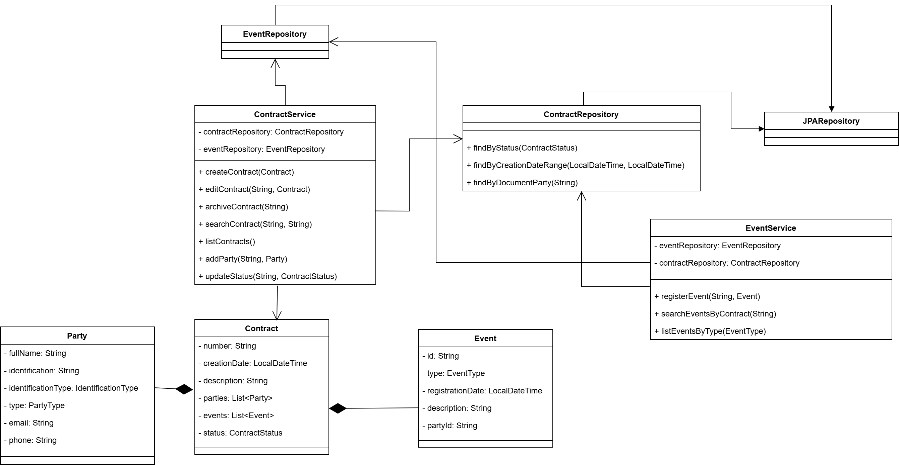
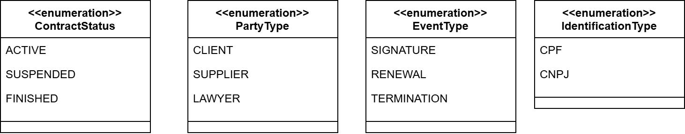
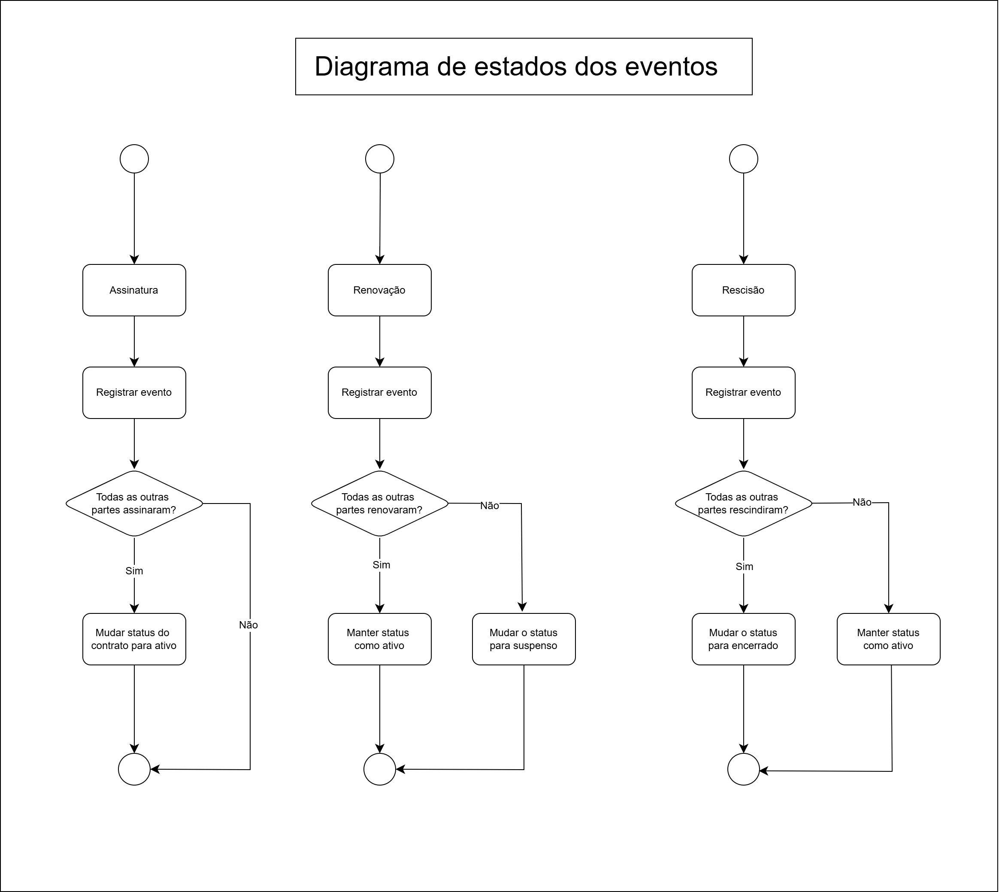

# Gerenciamento de contratos

### Documentação
#### Diagrama de classes
Este diagrama descreve todas as classes utilizadas no sistema. Dentre as classes POJO do sistema, também foram destacadas as classes Service e Controllers

#### Enums utilizados
Este diagrama descreve os enums utilizados no sistema, para descrever valores comuns utilizados no sistema

#### Diagrama de estados
Este diagrama descreve os estados possíveis para os eventos. Cada evento está mapeado e descrito como Assinatura, Rescisão e Renovação

