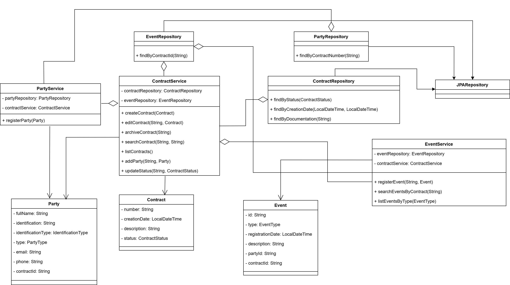

# Gerenciamento de contratos

## Avalicação comportamental
#### 1. Considere que você é o desenvolvedor responsável por uma nova funcionalidade para um sistema de gerenciamento de clientes. Durante a fase de desenvolvimento, você percebe que a funcionalidade planejada inicialmente não atende a todos os requisitos do cliente. Seu líder lhe solicita um posicionamento sobre a situação. O que você faria nesse cenário e qual seria sua resposta?
- Primeiramente eu analisaria tudo o que possuo registrado sobre a necessidade do cliente: documentação, casos de uso e quaisquer detalhes registrados. Após isso eu reuniria todas as possíveis funcionalidades faltantes no sistema e enviaria uma lista de problemas, e as possíveis soluções que poderíamos ter para esses problemas. Caso fosse necessário, e solicitado pelo meu líder, entraríamos em reunião para conversar possíveis dúvidas que a minha proposta possa ter gerado.

- Depois de realizadas todas essas definições, eu partiria para o desenvolvimento de uma documentação/arquitetura atualizada para as novas funcionalidades, com os testes definidos, e começar o desenvolvimento de fato.

#### 2. Considere que você está trabalhando em um projeto importante que envolve integração com um sistema legado. Durante a implementação, você descobre que a documentação do sistema legado está desatualizada e várias funcionalidades não estão funcionando como esperado. Seu líder lhe pede para priorizar essa integração. Quais seriam suas ações e como você lidaria com essa situação?
- Primeiramente, seria importante avaliar a gravidade da situação: analisar quais funcionalidades são afetadas pelo sistema legado. A partir disso, comunicar meu líder e os possíveis stakeholders do projeto com relação ao impedimento, e uma estimativa pra essa resolução.

- Depois dessa etapa, começaria a fazer testes específicos em cada funcionalidade, e determinar em quais funcionaliades poderíamos ter uma solução provisória, e quais não há soluções para o momento. Implementar as soluções temporárias para as funcionalidades mais críticas, documentar e registrar qual o débito técnico seria gerado por essa decisão. Depois de tratadas as funcionalidades críticas, fazer uma posterior análise de prioridades, e conversar com o time qual deveria ser o foco do momento: outras tasks, ou o sistema legado.

#### 3. Considere que você acabou de concluir e liberar uma nova funcionalidade para produção, mas os testes automatizados não cobrem todos os casos de uso. Após a liberação, os usuários começam a reportar problemas. Na sua opinião, quais seriam as ações a serem realizadas do momento em que o problema chegou ao seu conhecimento até a correção dele?
- A primeira ação seria obter os feedbacks dos usuários e tentar reproduzir o problema, observando quais casos de teste estão falhando. A partir disso elaboraria uma possível solução, priorizando o prazo para retorno dessa funcionalidade para o cliente. Informar o time qual a gravidade da situação, e se a medida de correção dispenderia de muito tempo de trabalho.

- Garantir que os testes sejam condizentes, implementar a solução e acompanhar juntamente do time de implantação qual o impacto terá com o cliente.

#### 4. Considere que você está trabalhando em uma implementação complexa e estratégica para viabilizar uma entrega contratual cujo prazo não pode ser repactuado. Durante a implementação, você encontra dificuldades técnicas que não estavam previstas, levando você a estimar um atraso de dois dias na entrega prevista. Quais seriam suas considerações e encaminhamento nesse cenário?
- Primeiramente, comunicar à liderança e ao time o impeditivo, e conversar sobre possibilidades. Deixar claro que a tarefa tomou uma complexidade maior do que a esperada, e buscar possivelmente apoio a outros membros do time. Além disso, analisaria a possibilidade de uma entrega com todas as funcionalidades para o cliente, mas com implementações mais simples. 

- Fora isso, caso não fosse contra a cultura da empresa e a rotina do time, me disponibilizaria para fazer um trabalho extra e tentar garantir a entrega no prazo. 
## Implementações não especificadas
Esta sessão tem como objetivo descrever decisões de arquitetura tomadas que diferem da proposta realizada. São pequenas implementações que, apesar de não especificadas, ajudaram no processo de desenvolvimento e nas implementações de regras de negócio

1. Na classe `Event`, localizada em `src/main/java/ai/attus/gerenciamento_contratos/models/Event.java`, foi adicionada uma propriedade `partyId`. Isso foi realizado para controle de quais partes assinaram um documento, e assim realizar o controle de assinaturas duplicadas
## Documentação
#### Diagrama de classes
Este diagrama descreve todas as classes utilizadas no sistema. Dentre as classes POJO do sistema, também foram destacadas as classes Service e Controllers

#### Enums utilizados
Este diagrama descreve os enums utilizados no sistema, para descrever valores comuns utilizados no sistema

#### Diagrama de estados
Este diagrama descreve os estados possíveis para os eventos. Cada evento está mapeado e descrito como Assinatura, Rescisão e Renovação


## Análise de qualidade
Para garantir a qualidade do código, foi utilizado o SonarQube. Para utilizar o Sonar, primeiro é necessário baixar e iniciar a imagem Docker com o seguinte comando:
```
$ docker run -d --name sonarqube -e SONAR_ES_BOOTSTRAP_CHECKS_DISABLE=true -p 9000:9000 sonarqube:latest
```

Depois de realizadas todas as configurações dentro do Sonar, rodando em `localhost:9000`, é necessário rodar o seguinte comando:
``` 
mvn clean verify sonar:sonar 
  -Dsonar.projectKey=nome_projeto 
  -Dsonar.projectName='nome_projeto' 
  -Dsonar.host.url=http://localhost:9000 
  -Dsonar.token=seu_token_gerado_no_sonar
```

## PostgreSQL
### Configuração
Foi utilizada a imagem Docker do postgres para utilização de banco de dados. Para subir a imagem docker do Postgres, é necessário utilizar o seguinte comando:
```
   docker run --name gerenciamento-contratos -p 5432:5432 -e POSTGRES_PASSWORD=postgres -e POSTGRES_USER=postgres -e POSTGRES_DB=attus postgres:16.3
```
Para a criação de tabelas é necessário acessar a instância docker com o comando `docker exec -it gerenciamento-contratos psql -U postgres -d attus`. Foi utilizado o seguinte esquema de tabelas:
```
CREATE TABLE contracts (
        contract_number VARCHAR(50) UNIQUE NOT NULL PRIMARY KEY,
        creation_date TIMESTAMP,
        description TEXT,
        status VARCHAR(20)
        );

        CREATE TABLE parties (
        id VARCHAR(200) PRIMARY KEY,
        contract_id VARCHAR(50) REFERENCES contracts(contract_number),
        full_name VARCHAR(100),
        document VARCHAR(20),
        type VARCHAR(20),
        email VARCHAR(100),
        phone VARCHAR(20)
        );

        CREATE TABLE events (
        id VARCHAR(200) PRIMARY KEY,
        contract_id VARCHAR(50) REFERENCES contracts(contract_number),
        event_type VARCHAR(20),
        event_date TIMESTAMP,
        description TEXT,
        party_id VARCHAR(200)
        );

```

